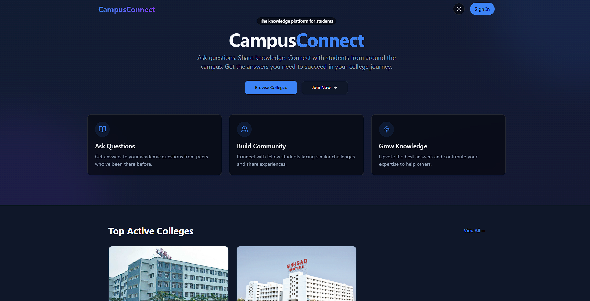

# Campus Connect

A comprehensive educational platform that connects students, faculty, and visitors within academic institutions. Campus Connect facilitates knowledge sharing, academic discussions, and community building through an intuitive web interface.

## Application Preview



_Campus Connect - Modern educational platform interface showcasing the homepage with navigation, hero section, and key features._

## Live Demo

**Frontend**: [https://campusconnect-io.netlify.app/](https://campusconnect-io.netlify.app/)  
**Backend API**: [https://campus-connect-2h5f.onrender.com](https://campus-connect-2h5f.onrender.com)

## Project Overview

Campus Connect is a full-stack web application designed to enhance academic collaboration and knowledge sharing within educational institutions. The platform provides role-based access for students, faculty, and visitors, enabling them to participate in academic discussions, share knowledge, and build meaningful connections.

### Key Features

- **Multi-Role Authentication System**: Secure registration and login for students, faculty, and visitors
- **College Management**: Browse and enroll in various academic institutions
- **Q&A Platform**: Post questions, provide answers, and engage in academic discussions
- **Real-time Communication**: Live updates using Socket.IO for instant notifications
- **Profile Management**: Comprehensive user profiles with academic credentials
- **Content Moderation**: Built-in reporting system for maintaining platform quality
- **Responsive Design**: Optimized for desktop and mobile devices
- **Admin Dashboard**: Administrative tools for platform management

## Technology Stack

### Frontend

- **React 18** - Modern UI library with hooks and functional components
- **Vite** - Fast build tool and development server
- **TypeScript** - Type-safe JavaScript development
- **Tailwind CSS** - Utility-first CSS framework
- **shadcn/ui** - High-quality React component library
- **React Router DOM** - Client-side routing
- **React Query** - Server state management
- **Zustand** - Lightweight state management
- **Framer Motion** - Animation library
- **React Hook Form** - Form handling with validation
- **Zod** - Schema validation

### Backend

- **Node.js** - JavaScript runtime environment
- **Express.js** - Web application framework
- **MongoDB** - NoSQL database with Mongoose ODM
- **Socket.IO** - Real-time bidirectional communication
- **JWT** - JSON Web Token authentication
- **bcryptjs** - Password hashing
- **Multer** - File upload handling
- **Nodemailer** - Email service integration
- **CORS** - Cross-origin resource sharing

### Deployment & Infrastructure

- **Frontend**: Netlify (Static hosting with CI/CD)
- **Backend**: Render (Cloud application platform)
- **Database**: MongoDB Atlas (Cloud database)
- **File Storage**: Local file system with Express static serving

## Project Structure

```
Campus-Connect/
├── backend/                 # Node.js/Express backend
│   ├── middleware/         # Authentication, upload, error handling
│   ├── models/            # MongoDB/Mongoose data models
│   ├── routes/            # API route handlers
│   ├── services/          # Business logic and external services
│   ├── utils/             # Utility functions and helpers
│   ├── uploads/           # File upload storage
│   └── index.js           # Main server entry point
├── Frontend/               # React frontend application
│   ├── src/
│   │   ├── components/    # Reusable React components
│   │   ├── pages/         # Page-level components
│   │   ├── hooks/         # Custom React hooks
│   │   ├── contexts/      # React context providers
│   │   ├── services/      # API service functions
│   │   ├── lib/           # Utility libraries
│   │   └── config/        # Configuration files
│   ├── public/            # Static assets
│   └── dist/              # Production build output
└── render.yaml            # Render deployment configuration
```

## Installation & Setup

### Prerequisites

- Node.js (v18 or higher)
- npm or yarn package manager
- MongoDB database (local or cloud)

### Backend Setup

1. Navigate to the backend directory:

```bash
cd backend
```

2. Install dependencies:

```bash
npm install
```

3. Create environment file:

```bash
cp .env.example .env
```

4. Configure environment variables in `.env`:

```env
NODE_ENV=development
PORT=8080
MONGODB_URL=your_mongodb_connection_string
JWT_SECRET=your_jwt_secret_key
FRONTEND_URL=http://localhost:5173
CORS_ORIGINS=http://localhost:5173,http://127.0.0.1:5173
EMAIL_USER=your_email@example.com
EMAIL_PASS=your_email_password
GEMINI_API_KEY=your_gemini_api_key
```

5. Start the development server:

```bash
npm run dev
```

### Frontend Setup

1. Navigate to the frontend directory:

```bash
cd Frontend
```

2. Install dependencies:

```bash
npm install
```

3. Create environment file:

```bash
cp .env.example .env
```

4. Configure environment variables in `.env`:

```env
VITE_API_URL=http://localhost:8080
VITE_SOCKET_URL=http://localhost:8080
```

5. Start the development server:

```bash
npm run dev
```

The application will be available at `http://localhost:5173`

## API Documentation

### Authentication Endpoints

- `POST /api/register` - User registration with role-based validation
- `POST /api/login` - User authentication
- `POST /api/logout` - User logout
- `GET /api/auth/status` - Check authentication status

### User Management

- `GET /api/profile` - Get user profile
- `PATCH /api/profile` - Update user profile
- `GET /api/users` - Get all users (admin only)

### College Management

- `GET /api/colleges` - Get all colleges
- `POST /api/colleges` - Create new college (admin only)
- `GET /api/colleges/:id` - Get specific college
- `PUT /api/colleges/:id` - Update college (admin only)

### Q&A System

- `GET /api/questions` - Get all questions
- `POST /api/questions` - Create new question
- `GET /api/questions/:id` - Get specific question
- `POST /api/answers` - Submit answer to question
- `GET /api/answers/:questionId` - Get answers for question

## Deployment

### Frontend Deployment (Netlify)

1. Connect your GitHub repository to Netlify
2. Configure build settings:
   - **Base directory**: `Frontend`
   - **Build command**: `npm run build`
   - **Publish directory**: `Frontend/dist`
3. Set environment variables:
   - `VITE_API_URL`: Your backend URL
   - `VITE_SOCKET_URL`: Your backend URL

### Backend Deployment (Render)

1. Connect your GitHub repository to Render
2. Configure service settings:
   - **Environment**: Node
   - **Build command**: `cd backend && npm install`
   - **Start command**: `cd backend && npm start`
3. Set environment variables as per the backend setup section

## Contributing

1. Fork the repository
2. Create a feature branch (`git checkout -b feature/amazing-feature`)
3. Commit your changes (`git commit -m 'Add some amazing feature'`)
4. Push to the branch (`git push origin feature/amazing-feature`)
5. Open a Pull Request

### Development Guidelines

- Follow ESLint configuration for code consistency
- Write meaningful commit messages
- Add appropriate error handling
- Include proper validation for user inputs
- Maintain responsive design principles
- Write clean, documented code

## Security Features

- JWT-based authentication with secure cookie handling
- Password hashing using bcryptjs
- Input validation and sanitization
- CORS configuration for cross-origin security
- File upload restrictions and validation
- Role-based access control
- Content moderation and reporting system

## Performance Optimizations

- React Query for efficient server state management
- Lazy loading of components and routes
- Image optimization and compression
- Database indexing for faster queries
- Caching strategies for frequently accessed data
- Minification and bundling optimization

## Browser Support

- Chrome (latest)
- Firefox (latest)
- Safari (latest)
- Edge (latest)

## License

This project is licensed under the ISC License.

## Support

For support and questions, please open an issue in the GitHub repository or contact the development team.

---

**Note**: Add a screenshot of the application interface to showcase the user experience and visual design.
